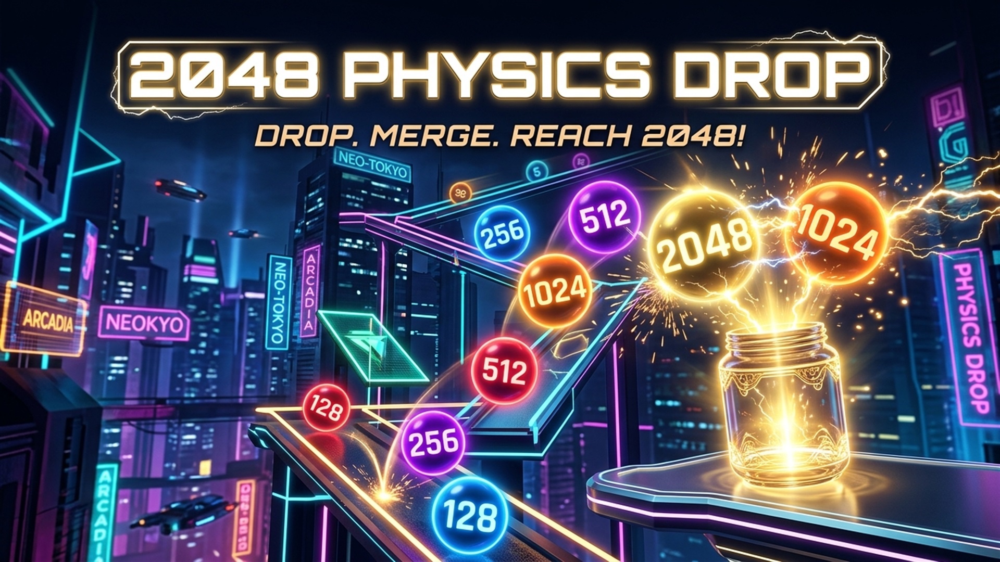

# 🎮 2048 Physics Drop | Chain Merge



A viral, highly addictive HTML5/JavaScript web game combining the classic **2048 puzzle mechanics** with **2D rigid-body physics (Matter.js)** and exciting **upward chain reactions** (inspired by Suika Game and 2048 Drop).

---

## ✨ Features

- ⚛️ **Matter.js 2D Rigid-Body Physics**: Realistic gravity, bounciness (restitution), and collision responses.
- 🦘 **Dynamic Upward Chain Jumps**: Merging two matching discs fuses them into double their value and launches the new disc upwards into the air, triggering epic mid-air cascading chain combos!
- 📈 **Progressive Drop Tiers**: As you unlock larger numbers inside the jar (64, 128, 256, 512, 1024, 2048+), higher-value discs automatically start dropping from the top!
- 🎵 **Web Audio API Procedural Synthesizer**: Cute, joyful pentatonic chimes, bounce plinks, and celebratory sound effects with zero external audio assets required.
- ⚠️ **Overflow Danger Zone**: Real-time danger line detection with countdown timer when discs pile up near the top.
- 📱 **Mobile & Desktop Optimized**: Responsive touch and mouse controls with retina-ready HTML5 Canvas scaling.
- 🌐 **Playgama Bridge SDK v2 Integrated**: Ready for cross-platform publishing with cloud saves, interstitial ads, and rewarded video revives.

---

## 🕹️ How to Play

1. **Aim**: Move your mouse or drag your finger horizontally across the top of the container.
2. **Drop**: Click or release to drop the numbered ball into the glass jar.
3. **Merge & Bounce**: When two identical numbers touch (2+2=4, 4+4=8, etc.), they merge and bounce into the air!
4. **Don't Overflow**: Keep the discs below the top danger line to stay alive and achieve your highest score!

---

## 🚀 Running Locally

### Option 1: Direct File Open
Simply double-click `index.html` to open and play the game in your favorite web browser.

### Option 2: Local HTTP Server (Recommended)
Using Node.js:
```bash
npx serve .
```
Then visit `http://localhost:3000` in your browser.

---

## 🌐 Deploying to GitHub Pages (Free Live Web Game)

You can host this game on the web for free using GitHub Pages:

1. Push this repository to your GitHub account.
2. In your repository on GitHub, go to **Settings** ➔ **Pages**.
3. Under **Branch**, select `main` (or `master`) and `/ (root)`.
4. Click **Save**.
5. Within 1–2 minutes, your game will be live at:
   ```text
   https://<your-username>.github.io/<repository-name>/
   ```

---

## 📦 Project Structure

```text
2048-physics-drop/
├── index.html                   # Complete single-file game engine & UI
├── playgama-bridge-config.json  # Playgama Bridge SDK configuration
├── 2048-physics-drop-playgama.zip # Ready-to-upload archive for Playgama
├── cover_square.jpg             # 1:1 Cover art (800x800)
├── cover_portrait.jpg           # 9:16 Portrait poster (1080x1920)
├── cover_landscape.jpg          # 16:9 Banner art (1920x1080)
└── README.md                    # Project documentation
```

---

## 📄 License

This project is open-source and available under the [MIT License](LICENSE).
